# mariadbanalyst 👩‍🔧🦭🛢️
mariadbanalyst : MariaDB # SQL # JOIN # Relational Database

## Objective
- Explore MariaDB
- Use sql joins to combine data from multiple tables in a database

## MariaDB

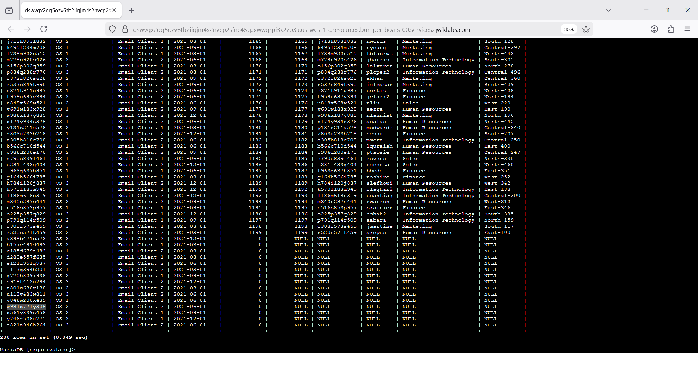

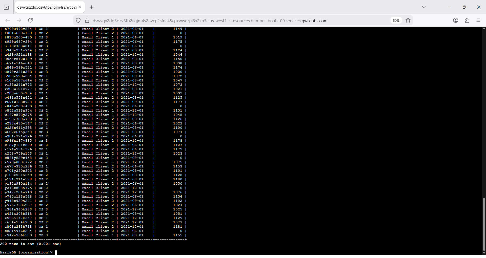

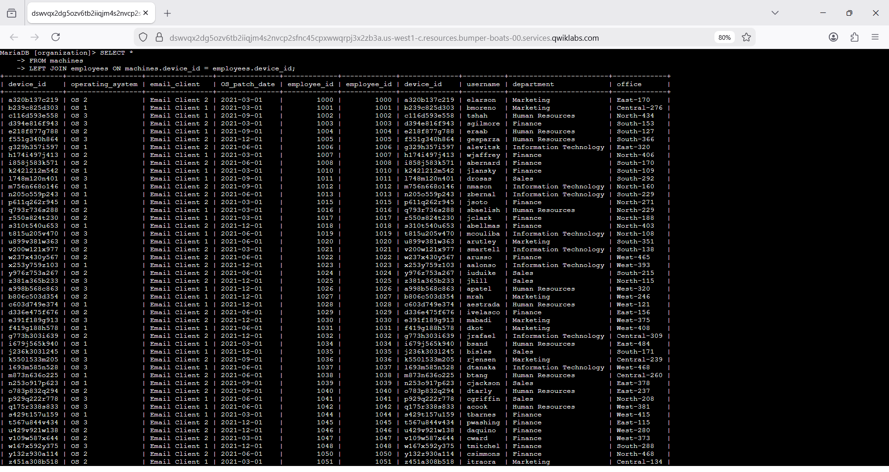

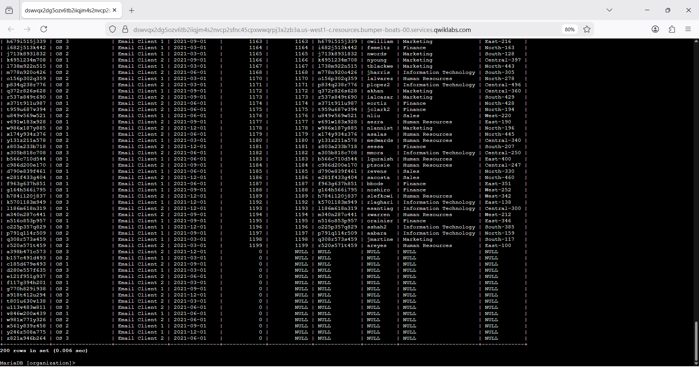

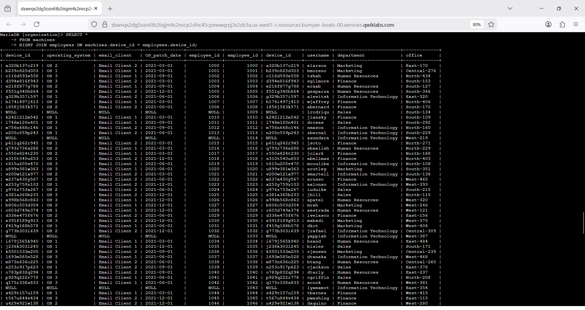

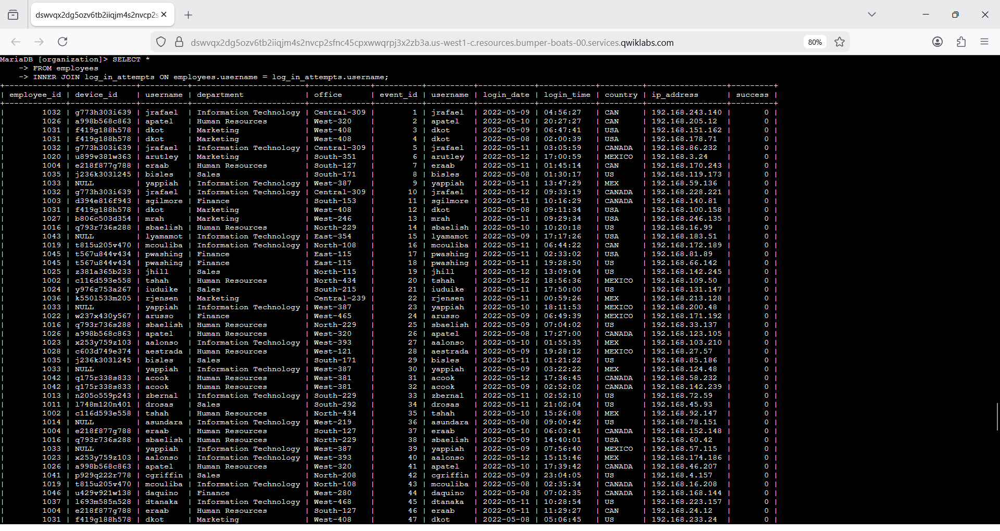

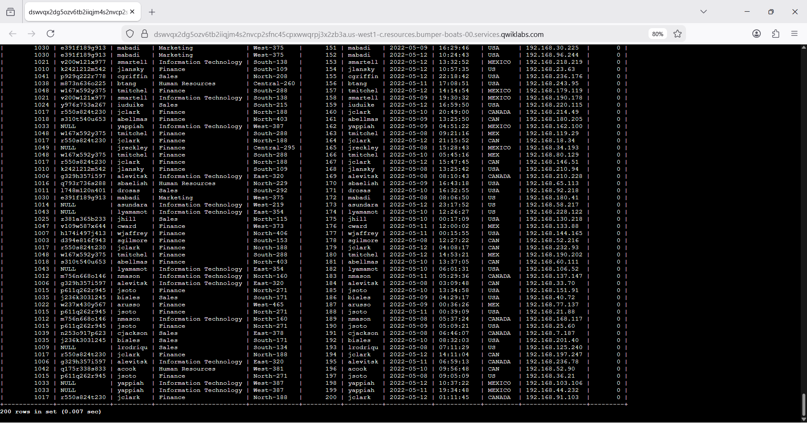

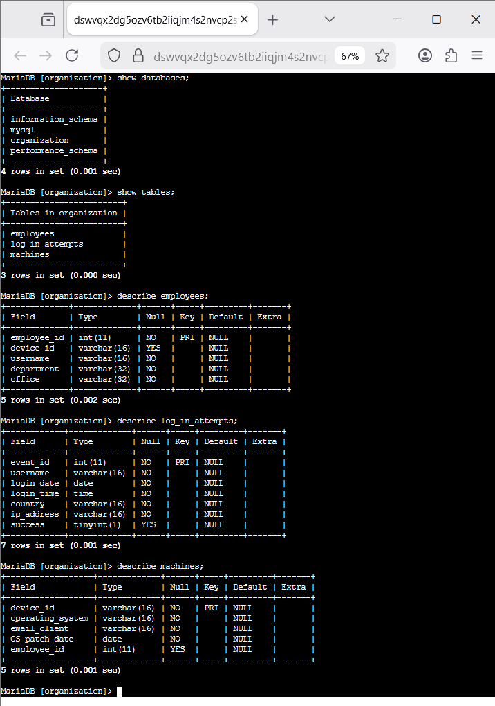

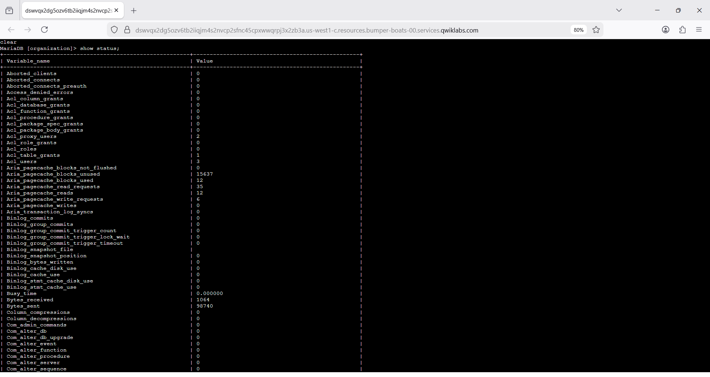

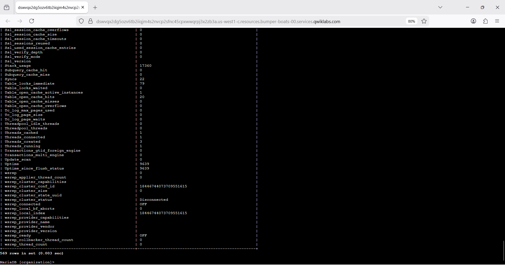

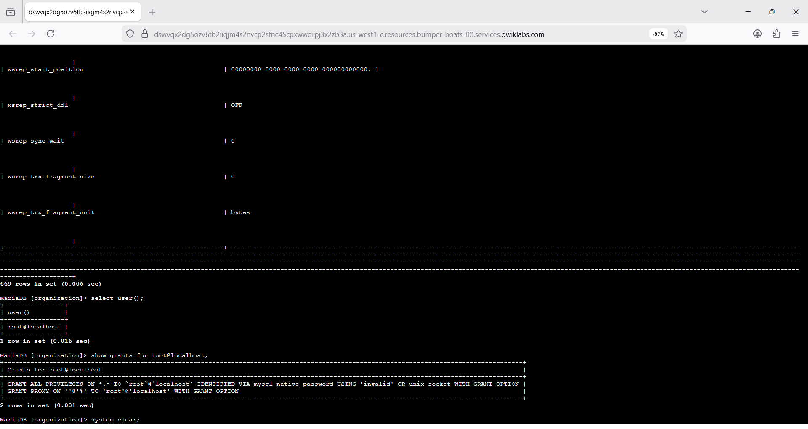

